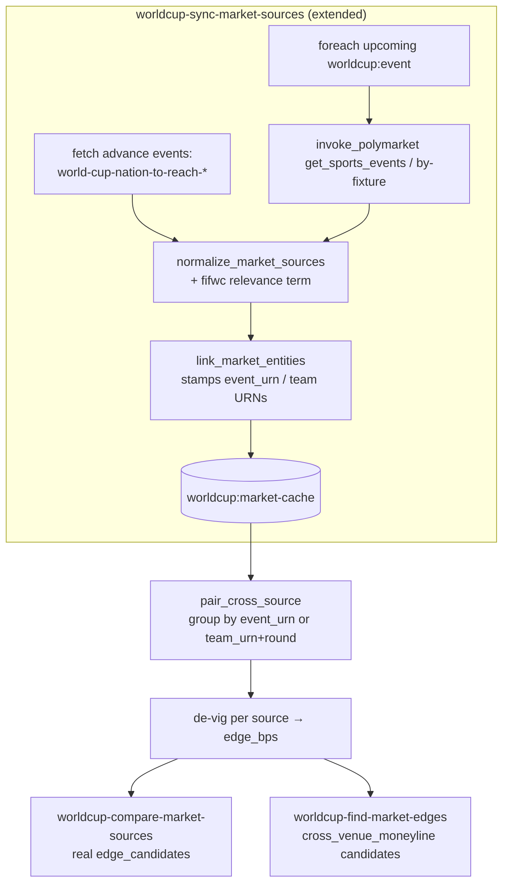

# feat: Cross-source Kalshi↔Polymarket market pairing for World Cup Intelligence

**Created:** 2026-06-30
**Type:** feat
**Depth:** Deep
**Target template:** `agent-templates/world-cup-intelligence`
**Origin:** solo plan (no upstream brainstorm); validated prototype at `scratchpad/prototype_cross_source.py`

---

## Summary

Kalshi game moneylines are ingested per-fixture; Polymarket's equivalent markets are not, because the sync only keyword-searches `"FIFA World Cup"` — which never matches a Polymarket market titled "Mexico vs. Ecuador". As a result there is nothing to compare apples-to-apples, and the cross-source surfaces are inert: `worldcup-market-normalization.yml` hardcodes `edge_candidates: []` with a "pairing pending" warning, and `detect_market_edges`' `cross_venue_draw` detector can never fire (no Polymarket draw line in cache).

This plan (1) closes the Polymarket ingestion gap — per-fixture moneylines **and** the tournament "reach Round of 16 / QF / SF / Final" advance markets — and (2) adds a `pair_cross_source` engine command that pairs markets on the canonical `event_urn` already stamped by `link_market_entities`, de-vigs each book, and emits a cross-source edge in bps. The paired output replaces the dead stub in the compare workflow and extends `find-market-edges` from draw-only to full 3-way cross-venue.

Prices already confirmed live to align tightly (Mexico 0.435 / 0.43, Ecuador 0.225 / 0.23, Draw 0.335 / 0.33 across Polymarket/Kalshi), so the value is real once both sides land in cache.

---

## Problem Frame

- **What's broken:** Polymarket per-game and per-nation-advance markets never enter `worldcup:market-cache`. The `"FIFA World Cup"` keyword search returns futures/props but not game markets (titled by team).
- **Downstream effect:** `cross_venue_draw` in `detect_market_edges` is unreachable; the compare workflow's `edge_candidates` is a hardcoded `[]`; users cannot see both venues' price for the same outcome.
- **Why now:** World Cup knockout stage is live; both venues carry deep, liquid moneylines for the same games (Kalshi $2–9M/game; Polymarket $1–4M liquidity/game).

---

## Requirements

- **R1.** Polymarket per-fixture 3-way moneyline markets (win/lose/draw per game) land in `worldcup:market-cache`, normalized to the existing `WorldCupMarket` schema, for upcoming fixtures within the sync horizon.
- **R2.** Polymarket tournament advance markets (reach Round of 16 / Quarterfinals / Semifinals / Final) land in cache, one normalized record per nation, mapped to the nation's team URN.
- **R3.** Newly-fetched Polymarket game markets pass the World Cup relevance gate (today they would be filtered out — slug prefix `fifwc-` is not a recognized term).
- **R4.** A `pair_cross_source` engine command groups linked markets by `event_urn` (games) or advance-bucket (nation + round), aligns outcomes to a canonical key (team URN or `DRAW`), de-vigs each source across the group, and returns paired rows with both raw prices, both fair (de-vigged) probabilities, and the cross-source edge in bps.
- **R5.** `worldcup-compare-market-sources` returns real `edge_candidates` from `pair_cross_source`, replacing the `[]` stub and the "pairing pending" warning.
- **R6.** `worldcup-find-market-edges` surfaces full 3-way cross-venue moneyline dislocations (not just the draw line), via `event_urn` pairing rather than depending on `sports-skills match_markets`.
- **R7.** No trading/execution, no new providers, no change to the core `WorldCupMarket` field set. Read-only intelligence with existing disclaimers preserved.

---

## Key Technical Decisions

- **KTD1 — Pair on `event_urn`, not `match_markets`.** `link_market_entities` already stamps a canonical `event_urn` + `related_team_urns` on every market. Pairing on that is deterministic, same-pod, and needs no extra cross-venue API call. The existing `cross_venue_draw` detector depends on `sports-skills match_markets`, which is brittle and currently returns nothing for WC. The prototype validated `event_urn` pairing end-to-end. (see `scratchpad/prototype_cross_source.py`)
- **KTD2 — Reuse the existing `sports-skills invoke_polymarket` path.** It already exposes `get_sports_events`, `get_todays_events`, and `get_sports_markets` — no new connector or direct Gamma dependency. Ingestion is fixed by calling a *better command*, mirroring the `fetch-kalshi-upcoming` per-fixture sweep already in the sync.
- **KTD3 — De-vig before comparing.** Raw YES prices carry each book's overround; the apples-to-apples comparison is between de-vigged fair probabilities (normalize each source's 3-way to sum to 1.0). Report both raw and fair, with `edge_bps` computed on fair.
- **KTD4 — Advance markets keyed by `(team_urn, round)`, not `event_urn`.** Advance markets have no fixture; they are one Polymarket event per round (48 per-nation binaries, `groupItemTitle` = nation, `sportsMarketType: null`). Detect by event-slug prefix `world-cup-nation-to-reach-`; bucket by team URN within a round. Kalshi coverage may be absent for some rounds — pairing degrades gracefully to a single-source row.
- **KTD5 — Skip `unreliable` quotes in pairing.** Mirror `detect_market_edges`: drop `price_quality == "unreliable"` legs so settled/thin books (sum ≠ 1.0) can't throw fake edges.

---

## High-Level Technical Design



Pairing key resolution (directional):
```
for market in linked_markets where price_quality != "unreliable":
    if market.event_urn:            key_group = market.event_urn          # game
    elif advance_round(market):     key_group = (team_urn, round)         # advance
    bucket = team_urn(outcome_subject) or "DRAW"
group by (key_group, source) → de-vig YES across buckets → align buckets across sources → edge_bps
```

---

## Implementation Units

### U1. Polymarket per-fixture moneyline ingestion

**Goal:** Fetch each upcoming fixture's Polymarket 3-way moneyline and land it in cache (R1, R3).
**Dependencies:** none
**Files:**
- `agent-templates/world-cup-intelligence/workflows/worldcup-sync-market-sources.yml` (add a `fetch-polymarket-upcoming` task mirroring `fetch-kalshi-upcoming`; feed its output into `normalize-market-sources` via `polymarket_markets`)
- `agent-templates/world-cup-intelligence/worldcup-market-intelligence.py` (add `"fifwc"` to `WORLD_CUP_TERMS`, line ~19)

**Approach:** Reuse the `upcoming_team_queries` foreach already computed from `worldcup:event` docs. For each, call `sports-skills invoke_polymarket` with a command that returns the game's markets — prefer `get_sports_events` (events carry nested `markets`) or per-fixture resolution; filter to `sportsMarketType == "moneyline"`. Per KTD2, no new connector. The relevance gate in `_market_matches` must accept `fifwc-` slugs (R3) — adding `"fifwc"` to `WORLD_CUP_TERMS` is the minimal fix.

**Patterns to follow:** `fetch-kalshi-upcoming` task (foreach, `continue_on_error: true`, `concurrent: false`); the `polymarket_markets` input shape already accepted by `normalize_market_sources` (`_extract_source_records`).

**Test scenarios:**
- A Polymarket moneyline event (`fifwc-mex-ecu-2026-06-30`, 3 markets) normalizes to 3 `WorldCupMarket` records with `source: "polymarket"`, prices in 0–1, `price_quality: "ok"`.
- A market with slug `fifwc-*` and no "world cup" wording in title passes the relevance gate after the `WORLD_CUP_TERMS` change; an unrelated `nba-*` slug still fails it.
- `event_urn` is stamped by `link_market_entities` for the Mexico–Ecuador game (both team URNs resolved).

**Verification:** After a sync, `worldcup-search-markets {source: "polymarket", team: "Mexico"}` returns the moneyline legs (not just props), each with a resolved `event_urn`.

### U2. Polymarket advance-market ingestion

**Goal:** Ingest the four "reach Round of 16 / QF / SF / Final" events as per-nation normalized records (R2).
**Dependencies:** U1 (shares the normalize/link path and the `WORLD_CUP_TERMS` change)
**Files:**
- `agent-templates/world-cup-intelligence/workflows/worldcup-sync-market-sources.yml` (add a `fetch-polymarket-advance` task)
- `agent-templates/world-cup-intelligence/worldcup-market-intelligence.py` (`_polymarket_outcomes` / `_normalize_record`: use `groupItemTitle` as the outcome subject when present; tag a `market_type` like `advance_r16`)

**Approach:** Fetch the four known advance events by slug (`world-cup-nation-to-reach-round-of-16`, `-quarterfinals`, `-semifinals`, `-final`). Each yields ~48 per-nation binaries with `groupItemTitle` = nation and `sportsMarketType: null`; detect by event-slug prefix `world-cup-nation-to-reach-`. Normalize one record per nation, subject = `groupItemTitle`, mapped to team URN by `link_market_entities`. Skip `0/1` placeholder books via the existing `unreliable` flag.

**Patterns to follow:** existing Polymarket futures already in cache (e.g. `polymarket:2415420` "Will Mexico reach the Round of 16") — same shape, just fetched comprehensively per nation.

**Test scenarios:**
- The R16 event (48 markets) normalizes to one record per nation; `related_team_urns` resolves the nation via `groupItemTitle`.
- A `0 / 1` per-nation book is flagged `price_quality: "unreliable"`.
- `market_type` distinguishes advance rounds so pairing can bucket by round (KTD4).

**Verification:** `worldcup-search-markets {source: "polymarket", query: "reach the Round of 16"}` returns multiple nations, each team-URN-linked.

### U3. `pair_cross_source` engine command

**Goal:** Pure function that pairs normalized markets across sources and computes de-vigged cross-source edges (R4).
**Dependencies:** none (operates on normalized records; testable with fixtures)
**Files:**
- `agent-templates/world-cup-intelligence/worldcup-market-intelligence.py` (new `pair_cross_source(request_data)`, plus small helpers `_pair_bucket`, `_devig` — port from prototype)
- `agent-templates/world-cup-intelligence/tests/test_worldcup_market_intelligence.py` (tests)

**Approach:** Port `scratchpad/prototype_cross_source.py`. Input: linked `WorldCupMarket[]`. Drop `unreliable` (KTD5). Group by `event_urn` (games) or `(team_urn, round)` (advance, KTD4). Within a group, bucket each leg's subject to a team URN or `DRAW` (Kalshi subject = outcome name minus "Reg Time:"; Polymarket subject = `groupItemTitle` / "Will X win" / slug suffix). De-vig YES per source across the group (KTD3). Emit rows: `{event_urn|bucket_key, outcome, kalshi_yes, poly_yes, kalshi_fair, poly_fair, edge_bps, cheaper_venue}`. Return `{status, data: {pairs, count, warnings}}` matching engine convention (envelope stripped by the runtime).

**Technical design:** directional — see the pairing-key pseudo-code in High-Level Technical Design; the prototype is the reference implementation.

**Test scenarios:**
- *Happy path:* Mexico–Ecuador with both sources present → 3 rows (mexico/ecuador/DRAW); `edge_bps` matches the prototype within rounding (≈29/-62/34).
- *Single source:* only Kalshi legs present → rows with `poly_yes: null`, no `edge_bps`, no crash.
- *De-vig:* raw YES summing to 1.05 normalizes to fair probs summing to 1.0.
- *Unreliable skip:* a settled leg (0.99/1.00) is excluded from its group.
- *Advance bucket:* Polymarket "Mexico reach R16" pairs with a Kalshi R16 market (if present) under `(mexico_urn, r16)`; with no Kalshi counterpart, returns a single-source row.
- *Fuzzy team match:* "Reg Time: Mexico" and `groupItemTitle: "Mexico"` bucket to the same team URN; near-distinct nations do not collide.

**Verification:** `pytest tests/test_worldcup_market_intelligence.py -k pair_cross_source` passes; manual run on live cache reproduces the prototype table.

### U4. Wire pairing into `worldcup-compare-market-sources`

**Goal:** Return real `edge_candidates` from `pair_cross_source`, removing the dead stub (R5).
**Dependencies:** U3
**Files:**
- `agent-templates/world-cup-intelligence/workflows/worldcup-compare-market-sources.yml` (add a `pair-cross-source` connector task after `lookup-markets`)
- `agent-templates/world-cup-intelligence/mappings/worldcup-market-normalization.yml` (drop the hardcoded `edge_candidates: []` and the "pairing pending" warning; source `edge_candidates` from the task output)

**Approach:** Insert a connector task calling `worldcup-market-intelligence.pair_cross_source` on the loaded cache; map its `pairs` into the `comparison.edge_candidates` output. Keep `markets_by_source` as-is. Remove the now-false warning.

**Test scenarios:**
- Workflow returns `comparison.edge_candidates` with ≥1 paired row when both sources are cached for a live game.
- The "Edge detection is not yet implemented…" warning is gone.
- `markets_by_source` still splits kalshi/polymarket unchanged.

**Verification:** `execute_workflow worldcup-compare-market-sources {query: "Mexico Ecuador"}` returns populated `edge_candidates`.

### U5. Extend `find-market-edges` to full 3-way cross-venue

**Goal:** Surface cross-venue moneyline dislocations beyond the draw line (R6).
**Dependencies:** U3
**Files:**
- `agent-templates/world-cup-intelligence/worldcup-market-intelligence.py` (`detect_market_edges`: add a `cross_venue_moneyline` candidate family fed by `pair_cross_source`, pairing on `event_urn`)
- `agent-templates/world-cup-intelligence/workflows/worldcup-find-market-edges.yml` (no longer hard-depend on `match_markets` for cross-venue; pass paired rows)

**Approach:** Compute pairs via `pair_cross_source` inside `detect_market_edges` (or pass them in) and emit a `cross_venue_moneyline` candidate per outcome where `|poly_fair - kalshi_fair| * 10000 >= min_edge_bps`, carrying `cheaper_venue` and the resolution-rule caveats. Keep the legacy `cross_venue_draw` path for backward compatibility, but `event_urn` pairing supersedes it where both venues are cached. Preserve `unreliable` filtering and the 0.0-unpriced guard already present.

**Test scenarios:**
- Both venues cached for a game with a 70 bps Ecuador divergence → a `cross_venue_moneyline` candidate at `min_edge_bps=50`, suppressed at `min_edge_bps=100`.
- Draw-line edge still detected (no regression to `cross_venue_draw`).
- No `match_markets` input → cross-venue still works via `event_urn` (the prior code skipped entirely).
- Unreliable leg present → excluded, no fake edge.

**Verification:** `execute_workflow worldcup-find-market-edges {min_edge_bps: 50}` returns `cross_venue_moneyline` candidates with both venue prices.

### U6. Test consolidation and live verification

**Goal:** Lock behavior with fixtures and confirm against live data.
**Dependencies:** U1–U5
**Files:**
- `agent-templates/world-cup-intelligence/tests/test_worldcup_market_intelligence.py` (normalization fixtures for the new Polymarket game + advance shapes; pairing assertions if not already added in U3)

**Approach:** Add fixtures captured from the live Gamma payloads (game event + one advance event), asserting normalization and pairing. Run the full market-intelligence test module.
**Execution note:** Implement U3's `pair_cross_source` test-first against the prototype's known output, then make ingestion (U1/U2) green.

**Test scenarios:** covered by U1–U3 + U5 scenarios; this unit ensures they run together and adds the captured-payload fixtures.

**Verification:** full `pytest` for the module passes; one live `execute_workflow` of compare + find-edges shows paired output for a current game.

---

## Scope Boundaries

**In scope:** Polymarket per-fixture moneyline + advance ingestion; `pair_cross_source`; wiring into compare and find-edges; relevance-gate fix; tests.

**Deferred to Follow-Up Work:**
- Kalshi-side advance-market ingestion parity (if Kalshi lists per-nation advance series) — pairing degrades to single-source until then.
- Hourly cross-source snapshotting / movement of the *edge* itself.
- Promoting cross-source edges into signals/CLV.

**Out of scope (product identity):** any order placement, personalized financial advice, or new venues beyond Kalshi/Polymarket.

---

## Risks & Dependencies

- **Polymarket fetch command coverage.** `get_sports_events` may not window by horizon the way `fetch-kalshi-upcoming` does; if it returns all sports, WC filtering + the `fifwc` relevance term must carry the load. Mitigation: filter by slug prefix `fifwc-` at the task or normalize layer. (resolve at implementation)
- **Context-variable collision.** The sync file documents that connector-call inputs named `query`/`limit` clobber workflow state. New Polymarket tasks must use collision-free input names (follow the existing `search_query`/`max_markets` convention).
- **Advance-market team mapping.** `groupItemTitle` nation names must resolve through the team crosswalk/alias map (e.g. "South Korea" → `korea-republic`, "DR Congo"). Mitigation: extend `_MARKET_TEAM_ALIASES` as gaps surface.
- **Asymmetric advance coverage.** Kalshi may not offer matching advance markets; `pair_cross_source` must emit single-source rows without error (covered by U3 tests).
- **Resolution-rule mismatch.** Draw lines differ (90-min vs incl. extra time) across venues; caveats already exist in `detect_market_edges` and must be carried on `cross_venue_moneyline` rows.

---

## Sources & Research

- Prototype (validated live, 2026-06-30): `scratchpad/prototype_cross_source.py` — proved `event_urn` pairing + de-vig; output Mexico 29 bps / Ecuador −62 bps / Draw 34 bps.
- Live confirmation: Polymarket `fifwc-mex-ecu-2026-06-30` carries the full 3-way moneyline; `world-cup-nation-to-reach-*` events carry 48 per-nation advance binaries.
- Existing engine surfaces: `detect_market_edges` (within-venue book-sum, cross-venue draw, model-vs-market), `link_market_entities` (`event_urn` stamping), `normalize_market_sources` / `_normalize_record` (unified schema), `WORLD_CUP_TERMS` relevance gate.
- Connector capability: `sports-skills invoke_polymarket` exposes `get_sports_events` / `get_todays_events` / `get_sports_markets`.
