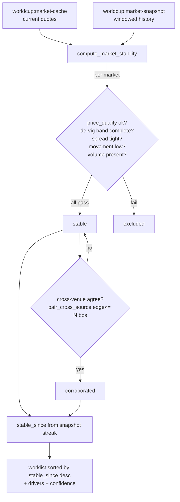

# feat: Market stabilization signal (stabilized-markets worklist)

**Created:** 2026-06-30
**Type:** feat
**Depth:** Standard
**Target template:** `agent-templates/world-cup-intelligence`
**Origin:** `docs/brainstorms/2026-06-30-market-stabilization-signal-requirements.md`

---

## Summary

A read-only "stabilized markets" worklist for the cross-source market layer shipped in PR #283. It flags markets whose Kalshi/Polymarket quote has settled into a stable, reliable, (optionally) cross-venue-agreeing state — the explainable inverse of the existing `price_quality: unreliable` flag — so BetFanatics' desk can use it as a faster re-enable trigger than waiting on their pricing feed. Computation is stateless: derived per call from `worldcup:market-cache` + `worldcup:market-snapshot`, reusing the de-vig band, `pair_cross_source`, and the snapshot movement primitives already deployed.

---

## Problem Frame

BetFanatics suspends a market when its price goes unreliable, then waits for their feed ("TX Fusion") to re-enable it (origin: Ciaran Foy call, 2026-06-30). We already normalize both venues and flag *unreliable* books; the gap is an explicit *stable* signal. Scoped for a 2-week demo that proves the signal is sound and explainable on live World Cup markets — not a measured latency win (we lack their suspension/feed data).

---

## Requirements (from origin)

- **R1.** Classify a market **stabilized** over a trailing snapshot window when all hold: currently `price_quality: ok`; book complete enough to de-vig (overround band, as in `pair_cross_source`); spread within a bps threshold; primary-outcome price moved less than a bps threshold across the window; volume/liquidity above a floor.
- **R2.** Cross-venue agreement (both venues price the outcome, de-vigged fair within N bps via `pair_cross_source`) **upgrades** confidence to `corroborated` but is **not** required — single-venue markets can be `stable` on R1 alone.
- **R3.** Each result carries `stable_since` (start of the current uninterrupted stable streak, from snapshot history), `confidence`, and a `drivers` list naming satisfied conditions.
- **R4.** A read workflow + MCP tool (`worldcup-stable-markets` / `worldcup_stable_markets`) returns the worklist, filterable by team/competition, sorted most-recently-stabilized first; read-only with the standard disclaimers.
- **R5.** Thresholds (spread bps, movement bps, agreement bps, volume floor, window length) are parameters with sane defaults.
- **R6.** Stateless — no new persistent state.
- **S1–S4.** Fires live; explainable; never marks thin/crossed/moving books stable; honest that latency-vs-feed is not benchmarked.

---

## Key Technical Decisions

- **KTD1 — Pure engine function over already-normalized records.** `compute_market_stability(markets, snapshots, params)` mirrors `compute_market_movers` / `pair_cross_source`: stateless, testable with fixtures, returns `{status, data}`. (see origin: KD1)
- **KTD2 — Reuse, don't reinvent, the gates.** Reliability = the existing `price_quality` field; completeness = the de-vig overround band already in `pair_cross_source`; movement = min/max of `primary_price` over the windowed `worldcup:market-snapshot` rows (same store `compute_market_movers` reads); agreement = `pair_cross_source` edge_bps. The function is a composition, not a new model. (origin: KD2)
- **KTD3 — `stable_since` from the snapshot streak.** Walk this market's snapshots newest→oldest while each stays within the movement band; the earliest in the unbroken run is `stable_since`. If only the current quote exists (no history yet), `stable_since` is null and the market is reported `confidence: provisional` rather than omitted — surfaces freshly-cached markets without over-claiming stability.
- **KTD4 — Single-venue stable is valid; agreement is an upgrade.** Confidence tiers: `provisional` (no/short history) → `stable` (R1 over the window, one venue) → `corroborated` (R1 + cross-venue agreement). (origin: KD3, R2)
- **KTD5 — Thresholds as workflow inputs with defaults.** Defaults are demo-sane starting points to calibrate with Ciaran, not load-bearing constants (origin Outstanding Question).

---

## High-Level Technical Design



Stability check (directional, not implementation spec):
```
window = snapshots for cache_id within window_hours
movement_ok = (max(primary_price) - min(primary_price) over window) <= movement_bps/1e4
stable = price_quality=="ok" AND devig_band_ok(book) AND spread<=spread_bps/1e4
         AND movement_ok AND volume>=floor
confidence = corroborated if (cross_venue_edge_bps for this bucket <= agreement_bps)
             else stable if has_window_history else provisional
drivers = [name for each passing condition]   # explainability (S2)
```

---

## Implementation Units

### U1. `compute_market_stability` engine command + tests

**Goal:** Pure, stateless stability classifier over normalized markets + snapshots (R1, R2, R3, R5, R6).
**Requirements:** R1, R2, R3, R5, R6, S2, S3.
**Dependencies:** none (operates on deployed data shapes).
**Files:**
- `agent-templates/world-cup-intelligence/worldcup-market-intelligence.py` (new `compute_market_stability`; small helpers for window-movement and the stable-streak walk; reuse `_yes_price`, the de-vig band, and `pair_cross_source` for agreement)
- `agent-templates/world-cup-intelligence/tests/test_worldcup_market_intelligence.py`

**Approach:** Params: `markets`, `snapshots`, `spread_bps` (default ~200), `movement_bps` (default ~150), `agreement_bps` (default ~150), `min_volume` (default a sane floor), `window_hours` (default ~6), `team`/`query` filters, `limit`. Drop `price_quality == "unreliable"` first. For each market evaluate the R1 gates; compute movement from the windowed snapshot rows for its `cache_id`; derive `stable_since` per KTD3; compute confidence per KTD4 using a one-time `pair_cross_source` pass over the input set to get per-bucket cross-venue edges. Emit `{cache_id, title, source, event_urn, related_team_urns, outcome, price, confidence, stable_since, drivers, volume, spread}`. Sort by `stable_since` desc (provisional last). Return `{status, data: {stable_markets, count, warnings, thresholds}}`.

**Patterns to follow:** `compute_market_movers` (windowed snapshot read + baseline walk), `pair_cross_source` (de-vig band, bucket agreement), `detect_market_edges` (unreliable filtering, caveats list).

**Test scenarios:**
- *Happy path / S2:* a market that is `ok`, tight spread, flat price across the window, volume present → returned `stable` with `drivers` naming spread/movement/volume; `stable_since` = earliest snapshot in the flat run.
- *Corroborated (R2):* both venues price the outcome and agree within `agreement_bps` → `confidence: corroborated`; widen one venue's price beyond `agreement_bps` → downgrades to `stable`.
- *Single-venue (R2):* only one venue present but R1 passes → `stable`, not excluded.
- *S3 — moving book excluded:* primary price swings more than `movement_bps` across the window → excluded (not stable).
- *S3 — unreliable/crossed excluded:* `price_quality: unreliable` (or wide spread) → excluded.
- *Volume floor:* volume below `min_volume` → excluded even if flat.
- *KTD3 — provisional:* market in cache but no snapshot history → `confidence: provisional`, `stable_since: null`, still returned.
- *Streak break:* a mid-window snapshot outside the movement band → `stable_since` is the start of the *latest* unbroken run, not the window start.
- *Filters/sort:* `team` filter narrows results; output sorted `stable_since` desc with provisional last.
- *Thresholds (R5):* tightening `spread_bps` flips a borderline market from stable to excluded.

**Verification:** `pytest -k market_stability` passes; a fixture mirroring the live cache (Kalshi "Yes"-named legs + Polymarket moneyline, with snapshot history) yields a sensible worklist.

### U2. `worldcup-stable-markets` workflow + MCP tool doc

**Goal:** Expose the classifier as a read workflow / MCP tool returning the worklist (R4).
**Requirements:** R4, R5, S1, S4.
**Dependencies:** U1.
**Files:**
- `agent-templates/world-cup-intelligence/workflows/worldcup-stable-markets.yml` (new)
- `agent-templates/world-cup-intelligence/docs/mcp-tools.md` (document `worldcup_stable_markets` under the Forecast & intelligence tier)

**Approach:** Mirror `worldcup-market-movers.yml`: load `worldcup:market-cache` (search-limit 500) and `worldcup:market-snapshot` filtered to `window_hours` (same `value.ts >= utcnow()-window` pattern), then a connector task calling `worldcup-market-intelligence.compute_market_stability` with the loaded markets/snapshots + threshold inputs. Workflow inputs expose the thresholds + `team`/`query`/`limit` with defaults; outputs `stable_markets`, `count`, `warnings`, `thresholds`. Read-only; include the standard resolution-risk disclaimer and the S4 caveat ("detection-vs-feed latency not benchmarked") in `warnings`. Add the doc entry describing inputs/outputs; note it is allowlisted like the other public read tools.

**Patterns to follow:** `worldcup-market-movers.yml` (cache + windowed-snapshot load → connector compute), `worldcup-search-markets.yml` (team/query/limit inputs), `docs/mcp-tools.md` existing tier entries.

**Test scenarios:**
- `Test expectation: none` for the YAML wiring itself beyond the engine tests, BUT include one **integration test** in `tests/test_worldcup_market_intelligence.py` that feeds realistic cache + snapshot fixtures through `compute_market_stability` and asserts the worklist shape the workflow returns (Covers S1) — guards the cache/snapshot field names the workflow passes (`value`, `ts`, `primary_price`) against the engine's expectations.
- *S4 caveat present:* the workflow surfaces the not-benchmarked caveat in `warnings`.

**Verification:** `execute_workflow worldcup-stable-markets {window_hours: 6}` on the live pod returns a worklist of stable markets with drivers; tightening thresholds shrinks it; doc entry renders.

---

## Scope Boundaries

**In scope:** the stability engine command, the workflow + MCP tool, explainable drivers, configurable thresholds, the realistic-fixture integration test.

**Deferred to Follow-Up Work:**
- Append-only `unstable → stable` **transition-event logging** + **detection-latency benchmarking** vs a feed baseline (needs Fanatics suspension events + TX Fusion timestamps).
- A push/webhook on transition (vs poll) — would promote the transition-event path into scope.
- Finer-grained snapshot cadence if the hourly bucket proves too coarse for a crisp demo (origin Outstanding Question; the snapshot id is hourly-bucketed today).

**Outside this product's identity:** any pricing/market-making/execution action; integration into Fanatics' internal re-enablement; ingesting their proprietary feed. Read-only intelligence only.

---

## Risks & Open Questions

- **Snapshot cadence (open, origin).** Hourly snapshots may be too coarse to show "low movement" crisply in a demo. Mitigation: `window_hours` default tuned to available history; finer cadence deferred. Resolve during the demo dry-run.
- **Default thresholds (open, origin).** Spread/movement/agreement/volume defaults are demo-sane guesses; calibrate with Ciaran against his re-enable risk tolerance. They are inputs, so no code change to retune.
- **Consumption shape (open, origin).** Polled worklist assumed; if Ciaran wants push, the deferred transition-event path comes into scope.
- **Provisional noise.** Newly-cached markets with no history report `provisional`; if that clutters the worklist, gate provisional behind an input flag (note for implementation, not pre-decided).

---

## System-Wide Impact

Additive and read-only. New engine function + new workflow; no change to existing market-cache/snapshot writes, the sync, or `pair_cross_source`/`detect_market_edges` behavior. Deploys to the pod via the same `import_templates_from_git` path used for PR #283. No migration, no persistent-state change.
